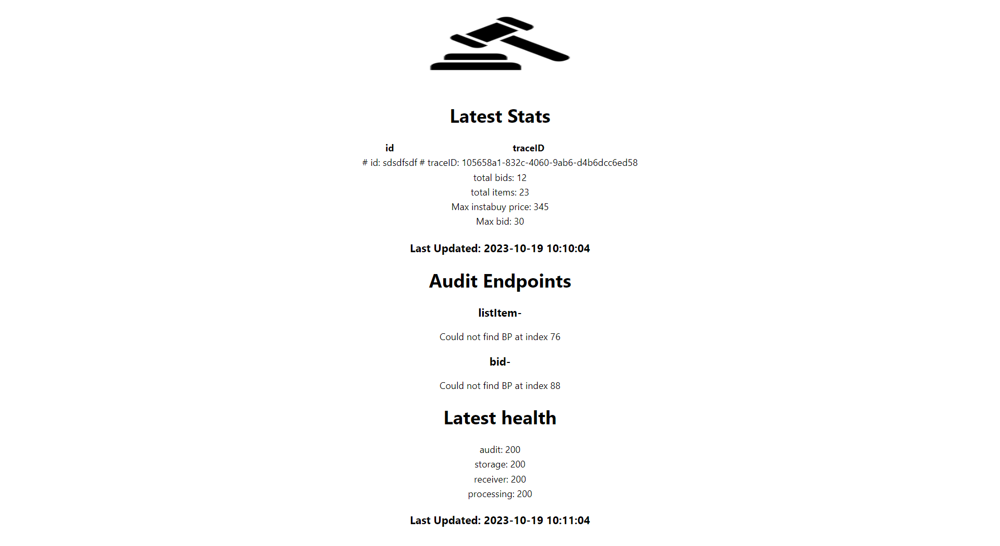
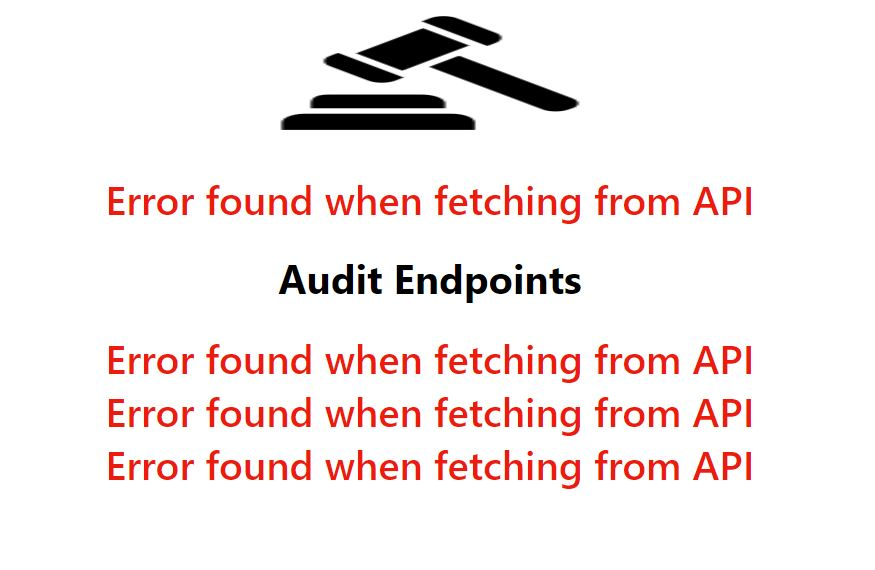

# Auction-a-Bidding-and-Listing-Solution


## Introduction
Post and bid on items while having low latency and high availability. Built using Python, Flask, OpenAPI, SQLite, Kafka, and React

## Services
- Dashboard: React website that lets you see the number of items and bids as well as the highest value bid
- Receiver: validate and forward incoming requests to the processing node
- Storage: save needed data to the database
- Processing: process incoming requests and send what is needed to the storage node
- Audit: centralized logging system
- Health Check: verify all nodes are up and running correctly and alerts when one or more is not
## Getting started 
### Prerequisites
You will need [Docker](https://docs.docker.com/desktop/install/windows-install/), as well as docker compose (comes build in woth docker desktop)
### Start Project
To start this project, you must download it.
1. Navigate to the `deployment` directory

2. Run `docker compose up -f docker-compose_kafka.yml` to start a Kafka cluster.

3. Set an environment variable called `KAFKA_DNS` to the IP of the Kafka cluster. If you run it locally, localhost should work. If you are using PowerShell, use: `New-Item -Path Env:\KAFKA_DNS -Value 'IP_OF_CLUSTER'`

4. For development, you want to use `docker compose up -f docker-compose_using_dockerfile.yml` as it points to the docker files for each microservice rather than docker images; otherwise, if you have pushed images of these services to dockerhub you can use `docker compose up`.

5. The dashboard should be visible on [http://localhost](http://localhost)

## Troubleshooting

- If this does not work, chances are the app_conf.yml did not pick up the environment variable for Kafka DNS. Try hardcoding it and rebuilding images with `docker compose up -f docker-compose_kafka.yml --Build`
- If this is not working, focus on getting each docker service to stay on, then, one at a time connect them to the healthcheck. If the healthcheck cannot see them, there is a network issue. Then work on connecting them to Kafka.
## Interacting with the Microservices
The services are setup with API end points, to place a bit or list an item, you need to make post requests to the receiver endpoints.. The two main endpoints are:
`/listItem` which requires a JSON body that looks like so
```
{
   "itemID":"string",
   "sellerID":"string",
   "description":"string",
   "maxCount":integers,
   "minPrice":integers,
   "instaBuyPrice":integers,
   "closingTime":"2022-12-15 10:10:04"
}
```
and `/bid` which requires a JSON body that looks like so
```
{
   "itemID":"string",
   "bidderID":"string",
   "bidID":"string",
   "bidCount": integers,
   "bidPrice": integers,
   "bidTime":"2022-09-15 10:10:04",
}
```

There are other endpoints, such as health checks, but they are not designed to be used by people. They are nicely displayed in openapi.yml for each service if you have an intest.

### Footnote
This is a great template to start off with if you are interested in building a microservice-based architecture. This had storage health checks and centralized logging, making debugging easy; it uses OpenAPI, so it's very easy to read; and a Kafka cluster provides low latency.

There is also a python_build.groovy in the Jenkins directory that can be used to make a new image build each time a commit is made, if you want to use a CI system.
